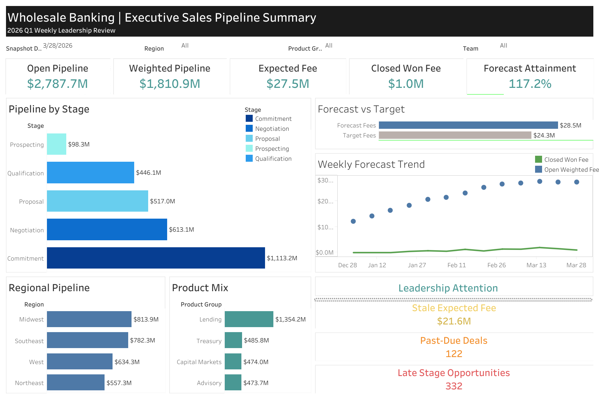

# Wholesale Banking Sales Pipeline & Forecasting Dashboard

An executive-style Tableau portfolio project for monitoring wholesale banking pipeline health, revenue forecasting, stale opportunities, relationship-manager follow-up, and quarter-end risk.

## Live Dashboard

[View the interactive dashboard on Tableau Public](https://public.tableau.com/views/WholesaleBankingExecutiveSalesPipelineSummary/Dashboard1)



## Dashboard Highlights

- `$2.79B` open pipeline and `$1.81B` probability-weighted pipeline
- `$28.5M` forecast fee compared with a `$24.3M` target
- `117.2%` forecast attainment for the selected reporting period
- Regional, product, stage, stale-deal, past-due, and late-stage risk views
- Interactive filters for snapshot date, region, product group, and RM team

## Tools Used

- Tableau Public
- SQL
- Python
- Jupyter Notebook / Google Colab
- CSV
- Git and GitHub

## Reproducible Data Generation

The synthetic dataset can be reproduced with
[`generate_sales_pipeline_data.ipynb`](generate_sales_pipeline_data.ipynb).

The notebook:

- creates the client, opportunity, product, relationship-manager, target, and weekly snapshot CSV files
- builds the dashboard-ready `mart_pipeline_weekly.csv` reporting table
- uses a fixed random seed so results are reproducible
- includes row-count and KPI validation checks
- creates a portable ZIP archive of the generated data

> Running all notebook cells overwrites CSV files with the same names in `data/raw/` and `data/processed/`.

## Data Folder

This project uses synthetic CSV files stored in the `data/` folder so the repository stays portable and easy to review.

### Folder Structure

```text
data/
├── raw/
│   ├── clients.csv
│   ├── opportunities.csv
│   ├── weekly_pipeline_snapshots.csv
│   ├── relationship_managers.csv
│   ├── products.csv
│   └── targets.csv
└── processed/
    └── mart_pipeline_weekly.csv
```

### Raw Data

- `clients.csv` - client master data with industry, region, segment, and relationship start date.
- `opportunities.csv` - opportunity-level sales pipeline records.
- `weekly_pipeline_snapshots.csv` - weekly snapshot history used for trend and pipeline monitoring.
- `relationship_managers.csv` - relationship manager metadata.
- `products.csv` - product hierarchy and fee type mapping.
- `targets.csv` - target fee and target pipeline values by quarter, region, and product group.

### Processed Data

- `mart_pipeline_weekly.csv` - the curated analytics mart that combines the raw files into a single reporting table.
- This is the preferred file for dashboard-ready analysis because it already includes joined dimensions and KPI fields.

## KPI Definitions

The dashboard uses a small set of governed KPIs so the analysis stays consistent across SQL, Tableau, and the README.

### Core KPIs

- **Pipeline**: Total open opportunity amount in the reporting period.
- **Weighted Pipeline**: Opportunity amount multiplied by probability.
- **Expected Fee**: Estimated fee value associated with an opportunity.
- **Weighted Fee**: Expected fee multiplied by probability.
- **Closed Won Fee**: Fee value from opportunities marked as closed won.
- **Stale Opportunity**: An opportunity with no recent activity and a high inactivity threshold.
- **Past Due Deal**: An opportunity whose expected close date has passed.
- **Late-Stage Deal**: A deal in a later pipeline stage that is still open and may be at risk.
- **Priority Follow-Up Flag**: A binary flag used to identify opportunities that need RM attention.

### Supporting Fields

- **Stage**: Current sales stage of the opportunity.
- **Status**: Overall opportunity status such as open, won, or lost.
- **Probability**: Likelihood of closing, used to calculate weighted metrics.
- **Days Since Last Activity**: Recency measure used to identify stale opportunities.
- **Quarter / Month / Week Number**: Time dimensions used for reporting and trend analysis.
- **Target Fee**: Leadership target for expected fee generation.
- **Target Pipeline**: Leadership target for pipeline value.

### Reporting Logic

- Use `data/raw/*` for source-level inspection and validation.
- Use `data/processed/mart_pipeline_weekly.csv` for reporting, KPI analysis, and Tableau dashboards.
- The SQL files in `sql/` are organized to mirror this flow:
  - exploration
  - modeling
  - metrics
  - validation

## Project Docs

- [Business Problem](docs/business_problem.md)
- [KPI Dictionary](docs/kpi_dictionary.md)
- [Data Dictionary](docs/data_dictionary.md)
- [Data Model](docs/data_model.md)
- [Insights Summary](docs/insights_summary.md)

## Notes

- All data in this repository is synthetic and created for portfolio purposes only.
- No real client, employer, or confidential banking data is included.
